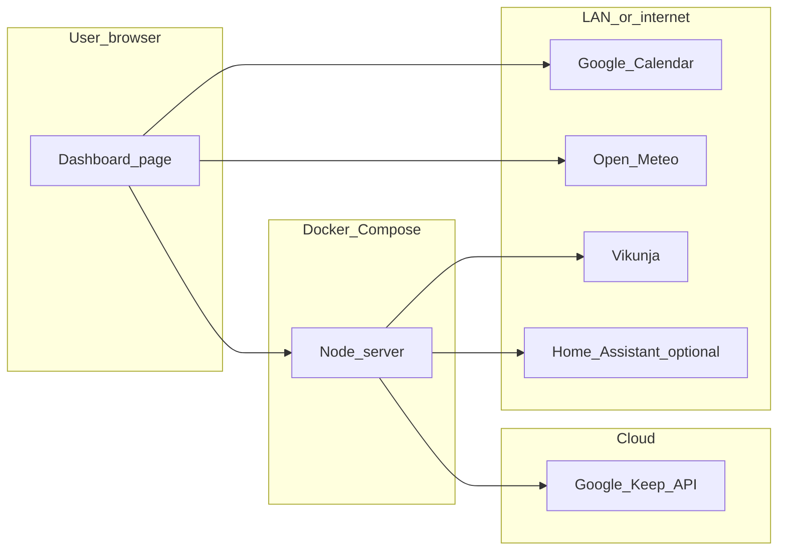

# V2 roadmap — deferred integrations

This repo is **dashbird**. This file lists **post–v1** work.

Cross-reference: v1 ships the dashboard shell and core panels; v2 items mount into existing layout slots where noted.

---

## Scope guardrails

- **Chat** — out of scope for this dashboard repo.
- **CompHealth** — separate project; not built here.
- **Hetzner / public VPS** — out of scope; dashbird stays **local LAN only**.
- **Desktop protocol tiles** (`cursor://`, local app launchers) — out of scope; bookmarks are web URLs only.

---

## V2 features (planned)

### 1. Vikunja-backed todos — **live**

- **Server:** `/api/vikunja/*` same-origin proxy (`VIKUNJA_BASE_URL` + `VIKUNJA_TOKEN` in server env only). Panel helpers: `GET/POST /api/vikunja/todos`, `PATCH .../done|undo`. Fail closed when unset. `VIKUNJA_PROJECT_ID` scopes the Today Todo panel (required).
- **Local stack:** `docker-compose.yml` includes a `vikunja` service (SQLite under `data/vikunja/`, UI on port `3456`). Bootstrap credentials live in `data/vikunja/credentials.txt` (gitignored).
- **Client:** Today’s To Do sidebar uses Vikunja (open tasks, add, complete). Local CSV `/api/todolist` removed. Subtasks / drag-and-drop deferred.

### 2. Google Keep snippets

- **Server:** OAuth2 refresh token, `GET /api/keep/summary` (read-only, short TTL cache).
- **Client:** small card widget; no Google tokens in the browser.

### 3. House Hunter (realtor / housing search)

- **UI slot today:** topbar tab + `public/js/panels/house-hunter.js` — **visual placeholder only** (layout cue, not a shipped feature).
- **V2 build:** criteria doc (must-haves, price, commute), listing sources (Redfin, Zillow, LoopNet, etc.) via official APIs or authorized exports — not brittle scraping.

### 4. Events

- **UI slot today:** left sidebar card `Events` — filters + feed from ingest (Gmail intake first); Settings has sources table, filter criteria, and ingestion smoke tests.
- **Live ingest:** Intake Gmail (`jay.intake.box@gmail.com`) via Gmail API OAuth — see Events sources roadmap §7. Facebook via Apify when configured. **Telegram** bot poller when `TELEGRAM_BOT_TOKEN` is set (`src/lib/events-finder-telegram.js`).
- **Map view — live:** Leaflet map alongside the list feed (`public/js/panels/events-finder.js`, geo from venue / criteria).
- **Event catalog:** local SQLite at `data/events-finder.db` (`src/lib/events-finder-store.js`) — sources upsert; feed reads the catalog. Criteria remain in `data/events-finder-criteria.json`.
- **V2 build:** more curated sources (Meetup, Eventbrite, Luma/Partiful), thumbs up/down + optional feedback window, preference store and ranking.
- **Per-source ingest plan:** [`docs/events-sources-roadmap.md`](events-sources-roadmap.md).

### 5. Personal / local news

- **UI slot today:** left sidebar card `Local News` — **visual placeholder only**.
- **V2 build:** personal/local feed with the same preference-learning pattern as Events.

### 6. Network (CRM)

- **Tab:** topbar **Network** page (`page-network`) — friends + business contacts CRM.
- **Fields:** people, notes, last contact, tags, org/title, channels, enrichment.
- **Ingest:** Telegram classifier routes contact messages into Network (same bot as events; distinct destination).

### 7. Optional expansions (v2 or later)

- **Home Assistant REST proxy** — `/api/home-assistant/*` with long-lived token in env.
- **Optional assistant controls** — tier → model map, spend caps, optional LiteLLM/Bifrost upstream.
- **AI provider pluggability** — OpenRouter stays default for now; evaluate direct OpenAI/Anthropic adapters behind one internal interface.
- **OpenRouter BYOK (cost)** — add provider API keys in the OpenRouter dashboard so provider traffic can use your own keys (often cheaper than OpenRouter-billed credits). Do when optimizing AI spend; not a daily ops item.
- **Cybersecurity stack follow-through** — §6 in [`docs/security-plan.md`](security-plan.md) is decided; Dependabot YAML is in-repo. Remaining: merge/push that config, flip GitHub Dependabot alerts + secret scanning/push protection in the UI, run the §1 cadence.

---

## What v1 must do so v2 is cheap

1. **Single Node entrypoint** — small router modules (`app.use('/api/vikunja', …)`).
2. **Front-end as modules** — one JS file per panel; add `todos.js` / `keep.js` without rewriting the shell.
3. **Shared fetch helper** — same-origin `/api/...` only.
4. **Env-only secrets** — `.env.example` documents unused v2 placeholders.
5. **Compose volume hooks** — optional `./secrets:/run/secrets:ro` for OAuth refresh files in v2.

---

## Target architecture (end of v2)

---

## Out of scope even for v2 (unless explicitly reopened)

- Chat surfaces in this dashboard.
- CompHealth workflows in this repo.
- Hetzner / public cloud deployment for dashbird.
- Desktop app launch / `cursor://` / local protocol bookmark tiles.
- Embedding or executing Lovelace YAML / HACS card bundles inside this app.
- Re-implementing Home Assistant inside this repo.
