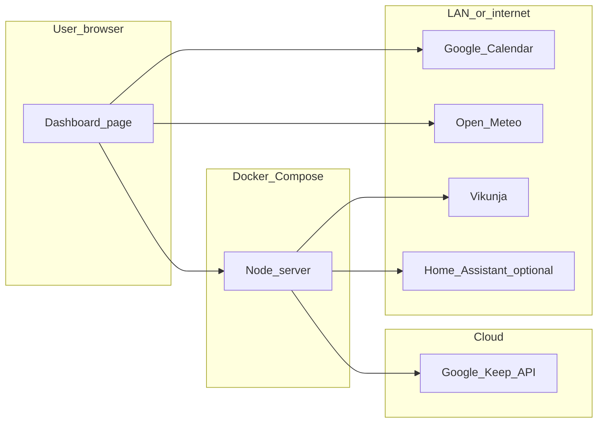

# V2 roadmap — deferred integrations

This repo is **dashbird** (renamed from the earlier **homeassistantdashboard** workspace; the recovered Cursor plan lives at `~/.cursor/plans/local_firefox_dashboard_26fbbff8.plan.md`).

**V1 scope** is defined in the Cursor plan *Local homepage dashboard* (project **dashbird**) for this workspace. This file lists **post–v1** work only.

Cross-reference: implement v1 first so the routes and panel modules described here mount cleanly.

---

## V2 features (planned)

Current scope guardrails:
- Chat is out of scope for this dashboard repo.
- CompHealth is out of scope for this repo and tracked as a separate project concern.

### 1. Vikunja-backed todos

- **Server:** `GET/POST/PATCH/DELETE` proxy under `/api/vikunja/*` (or `/api/todos/*` forwarding to Vikunja) with `VIKUNJA_BASE_URL` + token only in server env.
- **Client:** todo panel module — lists, subtasks, statuses, drag-and-drop reorder **as supported by Vikunja’s REST API** at implementation time.
- **Why v2:** multi-step UI + API mapping; v1 should ship the dashboard layout and core panels first without blocking on Vikunja semantics.

### 2. Google Keep snippets

- **Server:** OAuth2 (refresh token on disk or secret mount), call official [Google Keep API](https://developers.google.com/workspace/keep/api/guides) `notes.list` (read-only scope per current Google docs), short TTL cache, `GET /api/keep/summary` returning a small list (e.g. 3–5 notes: pinned first, then recent).
- **Client:** small card widget; no Google tokens in the browser.
- **Why v2:** consumer `@gmail.com` eligibility and OAuth consent are **high risk**; spike without holding v1 hostage.

### 3. Optional expansions (still v2 or later)

- **Home Assistant REST proxy** — `/api/home-assistant/*` with long-lived token in env; a few entity tiles on the same page as the rest of the dashboard.
- **Optional assistant controls** — tier → model map file, local spend caps, optional LiteLLM/Bifrost upstream swap (same OpenAI wire format).
- **AI provider pluggability (post-OpenRouter baseline)** — keep OpenRouter as default for now; evaluate/add direct provider adapters (for example OpenAI/Anthropic) behind one internal interface.
- **Cybersecurity plan** — create and maintain a lightweight security plan for this repo (threat model, secret handling rules, dependency/update cadence, incident response checklist, and periodic scan cadence).
- **Snyk billing/admin check** — verify account plan/usage visibility and set a recurring billing review checkpoint (outside app runtime, project-admin task).

---

## What v1 must do so v2 is cheap

1. **Single Node entrypoint** — register routes in a small router module so new mounts are `app.use('/api/vikunja', vikunjaRouter)` style, not tangled in one file.
2. **Front-end as modules** — e.g. one JS module per panel (`calendar`, `weather`, `bookmarks`, `notes`, `tool-library`); add `todos.js` / `keep.js` in v2 without rewriting the shell.
3. **Shared fetch helper** — all API calls to same origin `/api/...` so adding proxies does not change CORS story.
4. **Env-only secrets pattern** — establish `.env.example` with placeholders for `VIKUNJA_*`, `GOOGLE_*` / token paths **documented but unused** in v1 if desired.
5. **Compose volume hooks** — optional `./secrets:/run/secrets:ro` pattern in README for OAuth refresh files in v2.

---

## Target architecture (end of v2)

---

## Out of scope even for v2 (unless you explicitly reopen)

- **Chat surfaces** in this dashboard (separate project concern if reintroduced later).
- **CompHealth-specific workflows or integrations** in this repo.
- **Embedding or executing Lovelace YAML / HACS card bundles** inside this app (different runtime; see main plan comparison).
- **Re-implementing Home Assistant** inside this repo.
